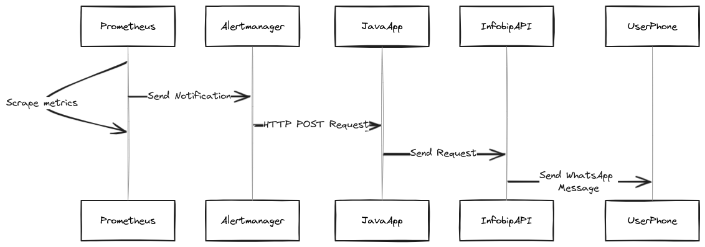

# Integrate Prometheus with Infobip WhatsApp API


## About

(Tutorial is available at <INSERT_LINK>)

This project illustrates how to integrate Prometheus with Infobip's WhatsApp API in order to receive alerts on a mobile
phone. The project has three parts: Prometheus, Alertmanager and a simple Spring boot application that connects the 
Prometheus alert with the Infobip's WhatsApp API. Here is a high level overview:



## Setup

Project requires an account on Infobip and a WhatsApp API key with the scope `whatsapp:message:send`, before running the 
application the placeholders in `application.properties` need to be replaced with:

- Infobip API key
- personal Infobip base url
- sender phone number
- recipient phone number

Project can be started by running the following command

```shell
docker compose up -d
```

After project starts up the Prometheus will be available at `http://localhost:9090` and Alertmanager at `http://localhost:9093`.
The Prometheus and Alermanager consoles can be used to inspect the status of the Alerts, the same alert should land on the recipient
phone number.

To shut down the example, the following command need to be executed from the project root directory:

```shell
docker compose down
```

